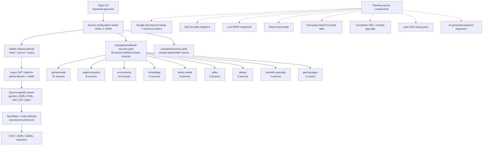

# Component Source Inventory and Pending Coverage

This file tracks the keyword-source components that are currently wired into the CLI and the source families that are still pending. It is intended to be the quick reference for source coverage before adding or validating more endpoints.

## Current source configuration files

| File | Purpose | Status |
| --- | --- | --- |
| `examples/notebook-sources.yaml` | Runnable imported source pack recovered from the endpoint-testing notebooks. | Active baseline source inventory. |
| `examples/sources.yaml` | Small documented example source configuration using placeholder endpoints. | Documentation/sample only. |

## Mermaid component map

## Active source family coverage

`examples/notebook-sources.yaml` currently contains 64 enabled source definitions, all tagged `notebook-import` plus one functional family tag.

| Source family tag | Count | Source IDs |
| --- | ---: | --- |
| `general-web` | 21 | `google-current-firefox-config`, `bing-current-firefox-config`, `duckduckgo-current-firefox-config`, `startpage-osuggestions`, `datamuse-sug`, `qwant-firefox-opensearch-suggest`, `google-firefox-json-legacy`, `google-chrome-json`, `google-toolbar-xml`, `google-chrome-omni`, `google-news`, `google-shopping`, `google-images`, `bing-os-json-legacy-host`, `bing-qsonhs-fragment`, `duckduckgo-original-host`, `ecosia-autocomplete`, `yahoo-gossip`, `brave-legacy-unauth-endpoint`, `ask-com`, `yandex` |
| `regional-search` | 8 | `baidu-opensearch-suggest`, `naver-opensearch-suggest`, `daum-opensearch-suggest`, `coccoc-autocomplete`, `1-1-suggest`, `web-de-suggest`, `mail-com-suggest`, `gmx-de-suggest` |
| `e-commerce` | 10 | `amazon-us-api-2017-all`, `amazon-us-api-2017-computers`, `amazon-us-api-2017-electronics`, `amazon-us-api-2017-books`, `amazon-us-api-2017-music`, `amazon-us-api-2017-software`, `amazon-legacy-us`, `amazon-uk-api-2017`, `amazon-de-api-2017`, `ebay-autosuggest` |
| `knowledge` | 8 | `wikipedia-opensearch-en`, `wikipedia-opensearch-lang-config`, `wikipedia-opensearch-de`, `wikipedia-opensearch-fr`, `wikipedia-opensearch-es`, `wikipedia-opensearch-ja`, `wiktionary-opensearch`, `wikimedia-commons-opensearch` |
| `music-media` | 6 | `musicbrainz-artist`, `musicbrainz-release`, `musicbrainz-recording`, `itunes-music-artists`, `itunes-software`, `itunes-movies` |
| `video` | 3 | `youtube-firefox`, `youtube-alternate`, `vimeo-public-video-search` |
| `places` | 3 | `nominatim-openstreetmap`, `photon-komoot`, `uk-government-search` |
| `scientific-specialty` | 4 | `pubmed-ncbi-esuggest`, `nasa-earthdata-cmr-autocomplete`, `open-library-authors`, `open-library-books` |
| `gaming-apps` | 1 | `steam-suggest` |

## Pending source components

These source components are in the product specification but are not yet implemented as source/enricher adapters in the current codebase.

| Pending component | Expected role | Notes |
| --- | --- | --- |
| Google Ads | Keyword ideas, average monthly searches, competition, bids, and monthly volume history. | Keep behind an optional adapter and never log OAuth, developer-token, refresh-token, or customer secrets. |
| SEO providers | Search volume, keyword difficulty, CPC, trend history, ranking-domain, and intent metrics. | Preserve provider name and observation date because provider metrics are not equivalent. |
| SERP providers | Live result snapshots and SERP feature detection. | Cache results and record provider usage/cost. |
| Search trends | Trend and seasonality signals. | Treat provider semantics as source-specific metadata. |
| Search Console | First-party query data. | Require explicit user opt-in before processing private data. |
| Competitor/content-gap sources | Competitor URL and domain rankability inputs. | Keep domain inputs separate from canonical keyword fields. |
| User CSV joins | Bring-your-own metrics or labels. | Validate schemas before joining and keep provenance for imported fields. |
| AI expansion | AI-generated keyword ideas and labels. | Optional only; mark AI provenance and run generated phrases through the same normalization and deduplication stages. |

## Maintenance checklist

- Update this file when a new source family tag is added to `examples/notebook-sources.yaml`.
- Update counts and source IDs when source definitions are added, removed, renamed, or disabled.
- Move pending components into active coverage only after their adapter, configuration validation, provenance handling, and tests are in place.
